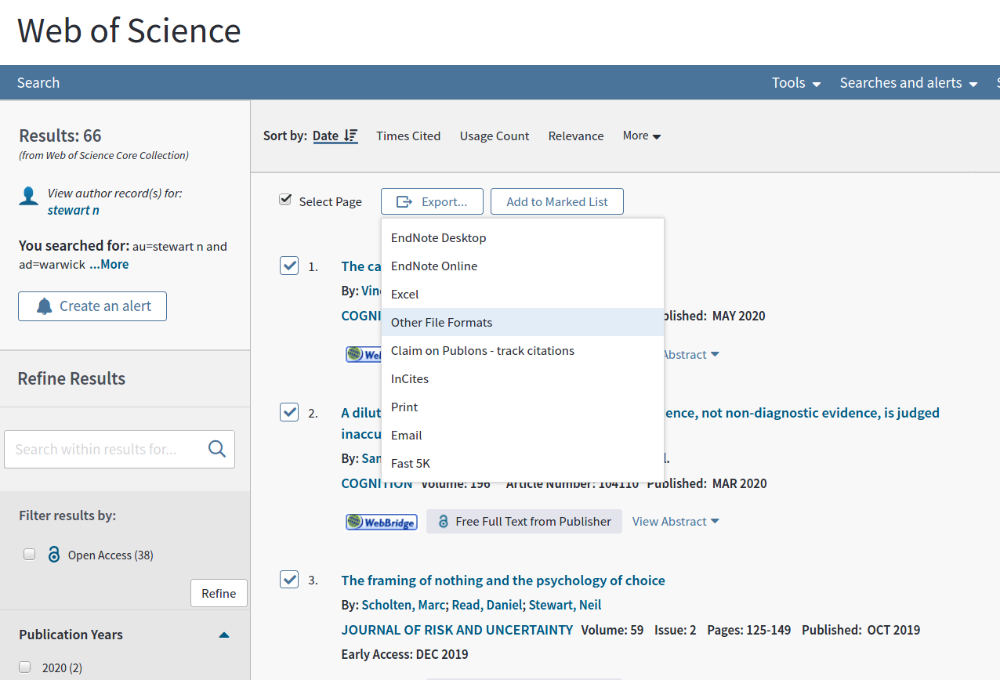

# wok2bib and wok2apa

wok2bib is a command line utility for converting Web of Knowledge or Web of Science saved records into bibtex references for use with latex. wok2apa converts records to plain text APA format. Both are written in perl. Here is an example of wok2bib and wok2apa at work:

```bash
$ cat savedrecs.txt
PT J
AU Zarkadi, T
Wade, KA
Stewart, N
AF Zarkadi, Theodora
Wade, Kimberley A.
Stewart, Neil
TI Creating Fair Lineups for Suspects With Distinctive Features
SO PSYCHOLOGICAL SCIENCE
SN 0956-7976
PD DEC
PY 2009
VL 20
IS 12
BP 1448
EP 1453
UT ISI:000272163600003
ER

PT J
AU Reimers, S
Maylor, EA
Stewart, N
Chater, N
AF Reimers, Stian
Maylor, Elizabeth A.
Stewart, Neil
Chater, Nick
TI Associations between a one-shot delay discounting measure and age,
income, education and real-world impulsive behavior
SO PERSONALITY AND INDIVIDUAL DIFFERENCES
SN 0191-8869
PD DEC
PY 2009
VL 47
IS 8
BP 973
EP 978
DI 10.1016/j.paid.2009.07.026
UT ISI:000271484400032
ER

$ cat savedrecs.txt | wok2bib
@article{Zarkadi09,
author = {Zarkadi, T.},
year = {2009},
title = {Creating fair lineups for suspects with distinctive features},
journal = {Psychological Science},
volume = {20},
pages = {1448--1453},
custom = {e},
}

@article{Reimers09,
author = {Reimers, S.},
year = {2009},
title = {Associations between a one-shot delay discounting measure and age, income, education and real-world impulsive behavior},
journal = {Personality and Individual Differences},
volume = {47},
pages = {973--978},
custom = {e},
}

$ cat savedrecs.txt | wok2apa
Zarkadi, T., Wade, K. A., & Stewart, N. (2009). Creating fair lineups for suspects with distinctive features. Psychological Science, 20, 1448-1453. 
Reimers, S., Maylor, E. A., Stewart, N., & Chater, N. (2009). Associations between a one-shot delay discounting measure and age, income, education and real-world impulsive behavior. Personality and Individual Differences, 47, 973-978.
```

# Options

There are no command line options.

# Installing wok2bib and wok2apa

I used perl version 5.8.8. You just need to download these files, make them executable, and put them in your path.

# Bugs

I've tested wok2apa and wok2bib on a set of about 30 references, but if you find any bugs please e-mail me (neil.stewart@warwick.ac.uk). Include the APA formatted reference text file, the version, and any output. Bug fixes are especially welcome.

# How to get records from Web of Knowledge



